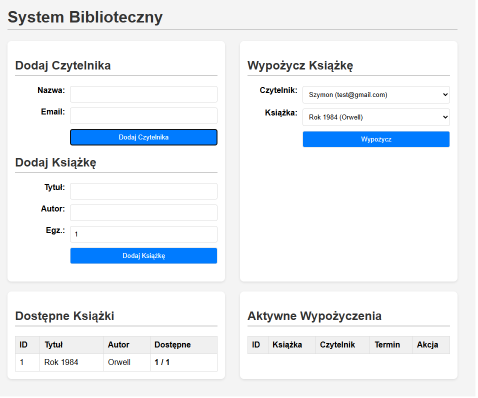
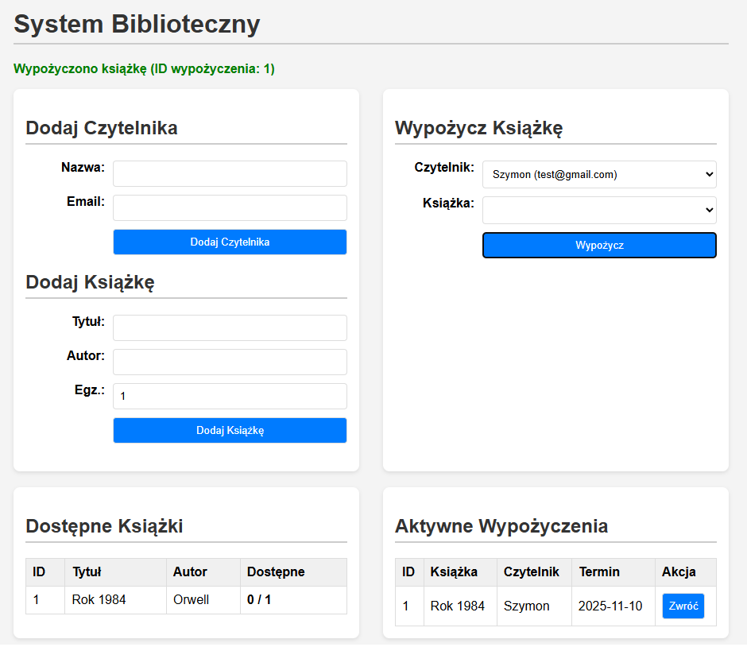

# Lab01 - Wypożyczalnia książek (Library)

Prosta aplikacja API (Flask) + UI (HTML/JS) do zarządzania wypożyczalnią książek, zrealizowana w ramach laboratorium WWSI.

## Użyty stos technologiczny
* **Backend:** Python 3
* **Framework API:** Flask + Flask-SQLAlchemy
* **Baza danych:** SQLite (plik `library.db`)
* **Frontend:** Czysty HTML, CSS i JavaScript (Fetch API)

---

## Instrukcja uruchomienia

Aplikacja została napisana w Pythonie 3.

1.  Sklonuj repozytorium lub pobierz pliki.
2.  Otwórz terminal w folderze projektu.
3.  Stwórz środowisko wirtualne:
    ```bash
    python -m venv venv
    ```
4.  Aktywuj środowisko:
    * Windows: `.\venv\Scripts\activate`
    * macOS/Linux: `source venv/bin/activate`
5.  Zainstaluj wymagane pakiety (Flask i SQLAlchemy):
    ```bash
    pip install Flask Flask-SQLAlchemy
    ```

6.  Uruchom serwer aplikacji:
    ```bash
    python app.py
    ```
7.  Aplikacja będzie dostępna w przeglądarce pod adresem:
    [http://127.0.0.1:5000](http://127.0.0.1:5000)

---

## Zrzuty ekranu ("Happy Path")

Poniżej znajdują się zrzuty ekranu pokazujące kluczowe funkcje aplikacji.

### 1. Widok po dodaniu książek i czytelników


### 2. Widok po wypożyczeniu książki (stan dostępności 0/1)


### 3. Próba dodania czytelnika z zajętym e-mailem (Test błędu 409)
